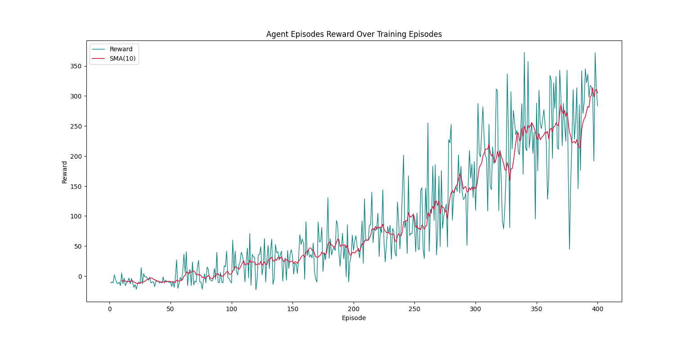

# 🐍 Deep Reinforcement Learning Snake Agent 🤖🔥

A fully custom **Snake Environment** + **Deep Q-Learning Agent (DQN)** built from scratch using:

- 🧠 TensorFlow / Keras  
- 🔢 NumPy  
- 📊 Matplotlib  
- 🎮 Custom Grid-Based Snake Environment  
- ♻️ Experience Replay  
- 🎯 Epsilon-Greedy & Boltzmann Policies  
- 💾 Model Save / Load Support  

---

# 🚀 Project Overview

This project implements a **Deep Q-Network (DQN)** agent that learns to play Snake autonomously using reinforcement learning.

The agent:

- Observes a local grid around its head 👀  
- Converts the observation into a feature vector  
- Predicts Q-values using a neural network 🧠  
- Learns from replay memory 📚  
- Gradually shifts from exploration to exploitation ⚖️  
- Optimizes cumulative reward over episodes 📈  

---

# 🏗️ Architecture

## 🐍 Environment (`SnakeEnv`)

A fully custom 2D grid environment:

- Random food spawning 🍎  
- Snake growth mechanics  
- Collision detection (wall & body) 🚧  
- Reward shaping using distance-to-food 📏  
- Configurable grid size  

### 🎯 Reward System

| Event        | Reward |
|-------------|--------|
| 🍎 Food      | +12    |
| 📍 Closer    | +1.5   |
| 🧱 Snake Hit | -11    |
| ❌ Out       | -10    |
| 🔄 Reverse   | -1     |

Reward shaping accelerates convergence and stabilizes training.

---

## 🤖 Agent (`SnakeAgent`)

### 🔥 Core Features

- Deep Q-Network (Fully Connected)
- Experience Replay Buffer
- Batch Training
- Gamma Discounting
- Epsilon Decay
- Temperature Scheduling
- Model Auto-Saving
- SMA (Simple Moving Average) smoothing
- Training & Testing modes

---

# 🧠 Model Architecture Example

```python
Agent.CreateModel(nDense=[1024], Activation='leaky_relu')
```

### Network Structure

```
Input Layer (State Vector)
        ↓
Dense(1024, leaky_relu)
        ↓
Dense(4, linear)  ← Q-values
```

---

# ⚙️ Training Configuration Example

```python
Agent = ag.SnakeAgent(
    Env,
    2,
    2,
    nEpisode=400,
    mStep=150,
    sMemory=1024,
    sBatch=64,
    Temperature1=10,
    Temperature2=1.5,
    TrainOn=32
)
```

---

# 📊 Exploration Scheduling

### 🎯 Epsilon Decay
- Starts at `0.99`
- Ends at `0.01`
- Linear decay across episodes

### 🌡 Temperature Decay
- Logarithmic decay
- Smooth transition from exploration to exploitation

---

# 📈 Training Visualizations

The following plots demonstrate the learning progression of the agent.

---

## 1️⃣ Agent Action Reward (≈ 400 Actions)

This plot shows **reward per action** during early training.

📌 Characteristics:

- High variance  
- Random exploration dominates  
- Unstable Q-value estimates  

```markdown

```

---

## 2️⃣ Agent Episode Reward (≈ 35,000 Actions)

This plot shows **total reward per episode** after extended training.

📌 Characteristics:

- Reward stabilization  
- Upward SMA trend  
- Improved food-seeking behavior  
- Reduced collision frequency  

```markdown

```

---

# 🧪 Generate Plots

```python
Agent.PlotActionLog(400)
Agent.PlotEpisodeLog(10)
```

---

# 🧩 Available Policies

| Policy | Description |
|--------|------------|
| `'R'`  | Random |
| `'G'`  | Greedy |
| `'EG'` | Epsilon-Greedy |
| `'B'`  | Boltzmann (Softmax) |

---

# 🏁 Results Summary

After ~35,000 actions:

✅ Agent learns directional food-seeking  
✅ Collision rate decreases significantly  
✅ Reward curve trends upward  
✅ Exploration anneals properly  
✅ Q-values stabilize  

---

# 💡 Future Improvements

- 🧠 Target Network (Double DQN)  
- 📦 Prioritized Experience Replay  
- 🐍 CNN-based state encoding  
- 📊 TensorBoard logging  
- 🎮 Larger grid experiments  
- 🚀 GPU optimization  

---

# ⭐ Why This Project Is Awesome

- Pure Reinforcement Learning from scratch 🔥  
- Custom-built environment (no Gym) 🧩  
- Fully configurable hyperparameters ⚙️  
- Clean modular implementation 🧼  
- Clear training visualization 📊  

---

# 🐍 Deep RL Snake — From Random to Intelligent

> Watching the reward curve stabilize after 35K actions is pure dopamine for ML engineers 🤯📈

---

If you like this project:

⭐ Star it  
🍴 Fork it  
🧠 Improve it  
🚀 Train it longer  

Happy Reinforcement Learning! 🎯🔥